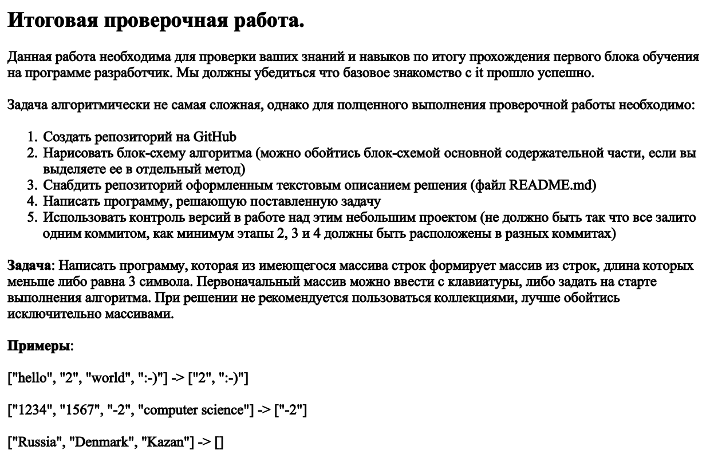
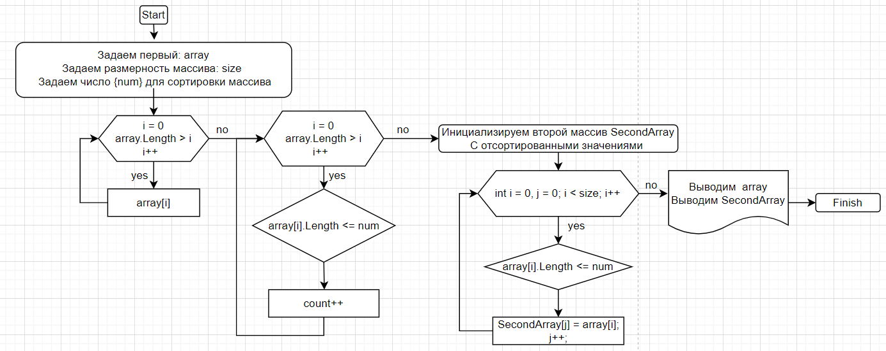

# Задание

## Шаг первый 
Задаем размерность одномерного массива. В нашем случае это так

int size = 6;

Инициализируем сам массив

string[] array = new string[size];

Для сортировки инициализируем число

int num = 3;

## Шаг второй

Создаем метод заполнения массива 

void FillArray(string[] array)

## Шаг третий 

Создаем метод для печати массива

void PrintArray(string[] array)

## Шаг четвертый 

Вызываем метод печати массива

PrintArray(array);

При запуске программы мы вводим любой символ и в любом колличестве через enter

## Шаг пятый 

Создаем метод который будет сортировать имеющийся массив по длине каждого элемента
массива равного или меньшего трем, это в цикле for

int SortedArray(string[] array)

Внутри метода инициализируем счетчик 

int count = 0;

Инициализируем цикл for 

 for(int i = 0; i < array.Length;i++)

 Проверяем условность выполнения задания

 if (array[i].Length <= num)

 При выполнение условия добавляем счетчику + 1, int count++
 
 При завершении завершении цикла возращаем count: return count;

 ## Шаг шестой

 Создаем метод для создания второго массива 

 string[] CreateSecondArray(string[] array)

 Внутри метода создаем новый массив с типом string в котором вызываем метод SortedArray

 string[] SecondArray = new string[SortedArray(array)];

 Инициализируем цикл for (int i = 0, j = 0; i < size; i++)

 и внутри цикла инициализируем новую переменную j для нашего нового массива

 И если if (array[i].Length <= num)

 То  SecondArray[j] = array[i];
  
  j++;

  И возращаем второй массив return SecondArray;

  ## Шаг седьмой 

  Вызываем метод печати массива внутри которой находится метод создания 
  второго массива

  PrintArray(CreateSecondArray(array));

# Блок схъема решения задачи

